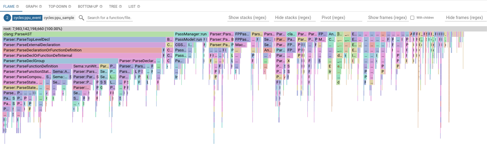
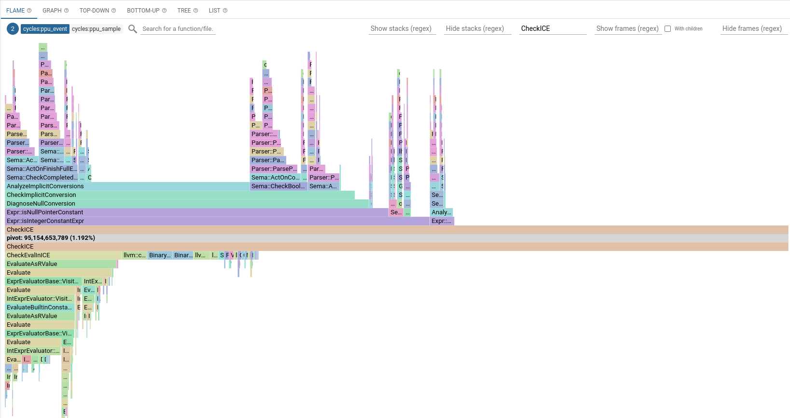

# Using Google's pprof for profiling the Linux Kernel

## Setup

*excerpt from https://github.com/google/pprof*

1. `$ go install github.com/google/pprof@latest`

2. Get Google's build tool, [bazel](https://bazel.build/install/ubuntu)

3. Build [perf_data_converter](https://github.com/google/perf_data_converter) with bazel.
```sh
> git clone https://github.com/google/perf_data_converter.git
> cd perf_data_converter
> bazel build src:perf_to_profile
```

4. move perf_to_profile binary to `/usr/local/bin` for ease of use.

`$ sudo cp bazel-perf_data_converter/bazel-out/k8-fastbuild/bin/src/perf_to_profile /usr/local/bin/perf_to_profile`

## Workflow

1. perf record something (Like a kernel build).
```sh
#x86_64 kernel build with cpu cycles
$ perf record -e cycles:pp --freq=256 --output=perf.data --call-graph lbr -- make LLVM=1 -j72
```

2. convert `perf.data` to profile proto using `perf_to_profile`.

`$ perf_to_profile -i perf.data -o profile.data`

3. Feed to pprof.

### Internally within Google
`$ pprof -flame -nodefraction .1 profile.data`

### Externally, must host web server locally
`$ pprof -http=":8000" -nodefraction .1 profile.data`

# Views

##### Flame
Visual representation of call stack. Promising optimization targets aer usually located in the widest call stack and are wider than expected. Most useful when paired with a **Pivot** (see below).

##### Graph
Visual representation of functional dependencies and recursive call chains. Very unreadable for large profiles.

##### Top-Down
Numerical listing of the hottest methods starting from the top.

##### Bottom-Up
Numerical listing of the hottest methods starting from the bottom.

##### Tree
Similar to Graph, but more readable for large profiles.

##### List
Essentially a flattened view of Bottom-Up. 

# Example View


# Pivot
Pivots are useful when investigating a specific hot method. They allow you to originate function calls coming in and calls going out. Careful, though, pprof pivots are case-sensitive!

# Example View w/ Pivot


`Expr::isIntegerConstantExpr` is the main caller of `CheckICE` and `CheckEvalInICE` is called frequently from `CheckICE`.
